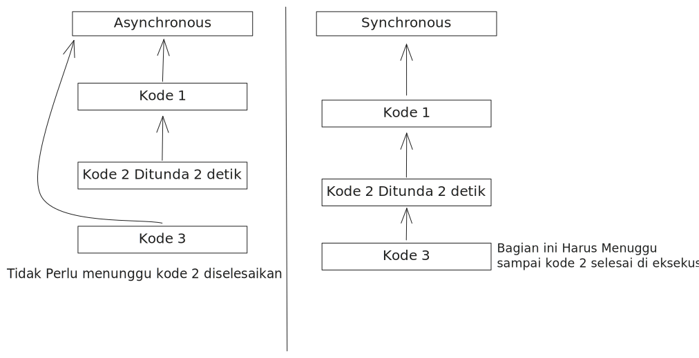
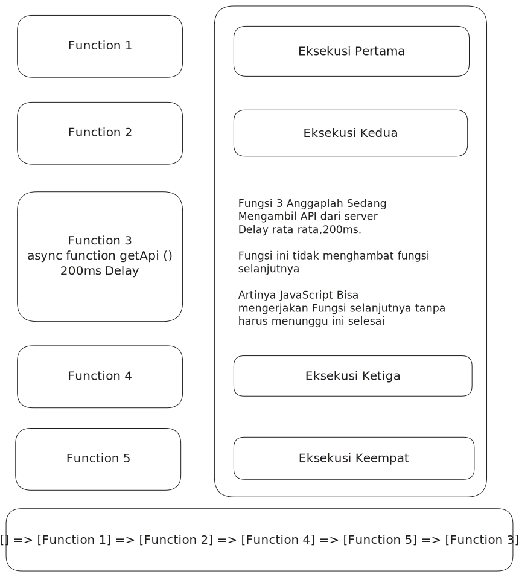
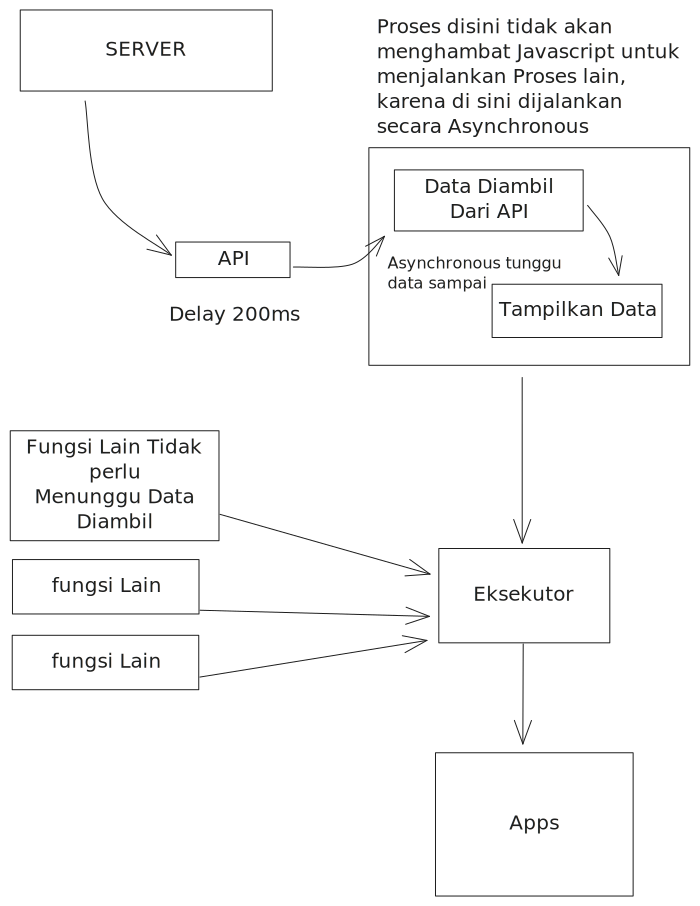

# Asynchronous Di JavaScript

Secara sederhana kode tidak berjalan sesuai urutan dari atas ke bawah, tanpa menunggu kode selesai di jalankan

Kenapa ini penting?. Bayangkan ada satu proses yang mengambil data API dari server, tidak mungkin langsung datang, normal nya harus menunggu 200 ms, dan kalau tanpa Asynchronous maka kode lain akan gagal di eksekusi karena terhambat satu proses saat mengambil API dari server

---

